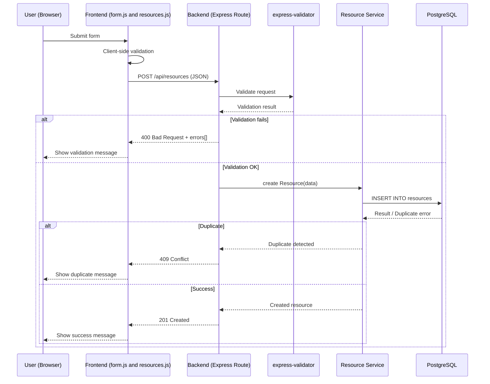
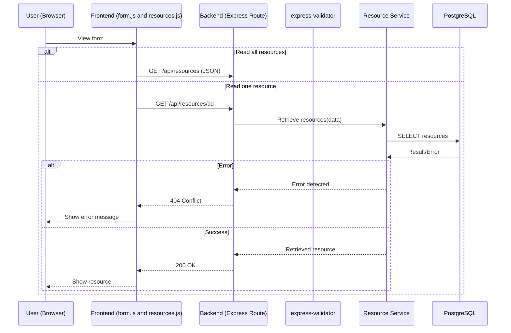
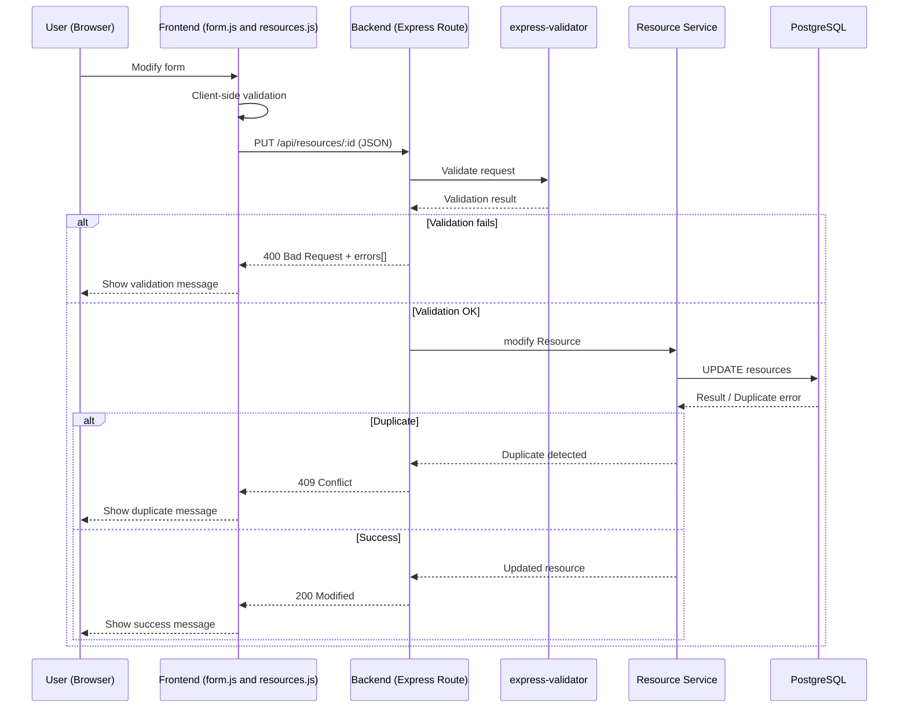

# 1️⃣ CREATE – RResource (Sequence Diagram)



# 2️⃣ READ — Resource (Sequence Diagram)



# 3️⃣ UPDATE — Resource (Sequence Diagram)



# 4️⃣ DELETE — Resource (Sequence Diagram)

```mermaid
sequenceDiagram
    participant U as User (Browser)
    participant F as Frontend (form.js and resources.js)
    participant B as Backend (Express Route)
    participant V as express-validator
    participant S as Resource Service
    participant DB as PostgreSQL

    U->>F: Delete form
    F->>B: DELETE /api/resources/:id (JSON)

    B->>S: delete Resource 
    S->>DB: DELETE FROM resources(data)
    DB-->>S: Result
    S-->>B: Deleted resource
    B-->>F: 204 Deleted
    F-->>U: Show success message
    end
```
